# 自动打怪逻辑流程图

> 本文件是打怪逻辑的**唯一权威说明**。改动 `decision.py` / `input_controller.py` / `player_locator.py` / `config.yaml` 里的战斗参数后，必须同步更新这里。
>
> 最后同步：2026-08-15，对应代码 `src/mxd_bot/decision.py` / `src/mxd_bot/input_controller.py` / `src/mxd_bot/gui_app.py`。

## 一句话概述

每帧抓一次游戏窗口画面 → YOLO + ByteTrack 找人和怪 → 选出一个**锁定目标** → 按横纵距离决定攻击 / 移动 / 跳跃 / 巡逻 → 动作经过防抖后才发给键盘。

## 检测类与动作类

| 层 | 个数 | 内容 |
| --- | --- | --- |
| YOLO 检测类 | 2 | 怪类名常见 `mob` / `monster`，玩家为 `player`；由 `model.monster_classes` 过滤 |
| 决策动作类 | 8 | `idle`、`move_left`、`move_right`、`attack`、`jump_left`、`jump_right`、`patrol_left`、`patrol_right` |

当前模型仍然只有 2 个检测类。完整的平台寻路下一阶段建议扩成 4 类：

| 建议检测类 | 用途 |
| --- | --- |
| `mob` | 选怪、攻击 |
| `player` | 玩家定位回退 |
| `platform` | 判断人物和怪物是否在同一层、平台边缘及落脚点 |
| `ladder` | 找梯子位置和上下端点 |

`up`（上箭头）是**动作**，不是画面中的物体，因此不应做成 YOLO 分类。等 `platform` / `ladder` 有真实标注并重训模型后，再增加 `climb_up` / `climb_down` 决策动作。现在只改 `dataset/data.yaml` 或增加空动作，会破坏现有权重的类别映射且永远不会触发，所以暂不添加。

距离坐标约定：

- 水平位置使用框中心 X；
- 竖直层级使用脚底 Y（`Box.ground_point = (center_x, bottom)`）；
- `dy = 怪脚底Y - 人脚底Y`，画面 Y 向下为正，因此 `dy < 0` 表示怪在更高的平台。

脚底比中心点更适合平台游戏：高矮不同的怪站在同一地面时，框中心不同，但框底应接近同一平台高度。

## 完整流程图

复制下面代码块的内容，粘贴到 [mermaid.live](https://mermaid.live) 即可生成图片。

```mermaid
flowchart TD
    A[开始一帧] --> B[capture.py<br/>按窗口标题抓客户区画面]
    B --> C[detector.py<br/>YOLO 推理 + ByteTrack 跟踪]
    C --> D[player_locator.py<br/>定位玩家]

    D --> D1{名字模板<br/>中间区域匹配到?}
    D1 -->|是| D4[玩家坐标 = 模板中心 + 偏移<br/>绿框]
    D1 -->|否| D2{YOLO 检出 player?}
    D2 -->|是| D5[玩家坐标 = YOLO 框中心<br/>黄框]
    D2 -->|否| D3{fallback_to_frame_center?}
    D3 -->|是| D6[玩家坐标 = 画面中心<br/>灰框]
    D3 -->|否| D7[玩家 = None]

    D4 --> E
    D5 --> E
    D6 --> E
    D7 --> Z1[动作 = IDLE]

    E[decision.py 选目标] --> E1[筛可达怪:<br/>竖直差 ≤ target_vertical_tolerance<br/>且 横向差 ≤ max_chase_horizontal_pixels]

    E1 --> F{已有锁定目标?}
    F -->|是| F1{按 track_id 匹配到?}
    F1 -->|是| F2[更新锁定目标坐标<br/>刷新最后可见时间]
    F1 -->|否| F3{距离上次可见<br/>≤ target_lost_grace_seconds?}
    F3 -->|是| F4[沿用旧目标位置<br/>宽限期内不换目标]
    F3 -->|否| F5[清空锁定，重新选]

    F -->|否| G
    F5 --> G

    G{可达怪列表为空?}
    G -->|是| H{画面里还有怪<br/>只是都够不着?}
    H -->|是| Z1
    H -->|否| Z2[无怪才巡逻:<br/>每 patrol_switch_seconds<br/>左右换向长按]

    G -->|否| I["取最近怪<br/>代价 = abs(dx) + 2 × abs(dy)"]
    I --> I1{与上帧候选是同一只?<br/>track_id 或 距离 ≤ target_match_radius}
    I1 -->|是| I2[候选帧数 +1]
    I1 -->|否| I3[候选帧数 = 1]
    I2 --> I4{候选帧数 ≥<br/>target_acquire_frames?}
    I3 --> I4
    I4 -->|否| Z1
    I4 -->|是| J[锁定该目标]

    F2 --> K
    F4 --> K
    J --> K

    K["计算地面锚点距离<br/>dx = 怪脚底中心x - 人脚底中心x<br/>dy = 怪bottom - 人bottom<br/>画面 Y 向下为正"]
    K --> L{上一帧在攻击?}
    L -->|是| L1[attack_limit =<br/>attack_range + attack_release_margin]
    L -->|否| L2[attack_limit = attack_range]

    L1 --> M
    L2 --> M

    M{"0 ≤ abs(dx) ≤ attack_limit<br/>且 abs(dy) ≤ vertical_tolerance ?<br/>贴脸也算在范围内"}
    M -->|是| M1{auto_attack_enabled?}
    M1 -->|是| Z3[动作 = ATTACK]
    M1 -->|否| Z1

    M -->|否| N{"怪在上方够高<br/>dy 小于负的 jump_when_target_above_pixels<br/>且 abs(dx) 仍大于 attack_range ?"}
    N -->|是| Z4[动作 = JUMP_LEFT / JUMP_RIGHT]
    N -->|否| O{dx < 0?}
    O -->|是| Z5[动作 = MOVE_LEFT]
    O -->|否| Z6[动作 = MOVE_RIGHT]

    Z1 --> S
    Z2 --> S
    Z3 --> S
    Z4 --> S
    Z5 --> S
    Z6 --> S

    S[_stabilize_action 防抖]
    S --> S1{动作 = ATTACK?}
    S1 -->|是| T[立即生效]
    S1 -->|否| S2{当前是巡逻<br/>且新动作是追怪/待机?}
    S2 -->|是| T
    S2 -->|否| S3{与稳定动作相同?}
    S3 -->|是| T
    S3 -->|否| S4[累计确认帧]
    S4 --> S5{连续 ≥<br/>action_confirm_frames?}
    S5 -->|是| T
    S5 -->|否| S6[保持上一个稳定动作]

    T --> U[input_controller.py 执行]
    S6 --> U

    U --> U1{dry_run<br/>仅预览?}
    U1 -->|是| U2[只打日志，不发按键]
    U1 -->|否| U3[不抢焦点<br/>切回且正在移动则重按方向键]
    U3 --> U6[SendInput 扫描码发键]

    U6 --> U4{动作类型}
    U4 -->|ATTACK| V1[松开方向键<br/>按 attack_key<br/>受 attack_cooldown_seconds 限制]
    U4 -->|MOVE / PATROL| V2[长按方向键<br/>方向不变就一直按住不松]
    U4 -->|JUMP| V3[按住方向 + 点 jump_key<br/>受 jump_cooldown_seconds 限制]
    U4 -->|IDLE| V4[松开所有键]

    V1 --> W[overlay.py 画框 → GUI 预览]
    V2 --> W
    V3 --> W
    V4 --> W
    U2 --> W
    W --> X[下一帧]
```

## 关键参数速查

全部在 `config.yaml` 里改，那份是程序实际读取的正式配置，已入库。下表的「当前值」就取自它。`config.example.yaml` 只是参数说明书，用来查某个配置项有哪些可选值，数值不必和 `config.yaml` 一致。

### 目标选择：`behavior`

| 参数 | 当前值 | 作用 | 什么时候调 |
| --- | --- | --- | --- |
| `target_vertical_tolerance` | 140 | 脚底竖直距离超过它的怪直接忽略 | 老追上层平台的怪就调小；同层怪不打就调大 |
| `max_chase_horizontal_pixels` | 420 | 横向超过它的怪不追 | 人物被远处误检拉走就调小 |
| `target_acquire_frames` | 2 | 新目标要连续出现几帧才锁定 | 一闪而过的误检导致乱走就调大 |
| `target_match_radius_pixels` | 120 | 没有 track_id 时，靠位置判定"还是同一只怪" | 怪移动快导致频繁换目标就调大 |
| `target_lost_grace_seconds` | 0.7 | 目标丢失后仍按旧位置追多久 | 检测闪断严重就调大，追空气就调小 |

### 攻击与移动：`behavior` + `profiles.<职业>`

| 参数 | 当前值 | 作用 | 什么时候调 |
| --- | --- | --- | --- |
| `profiles.warrior.attack_range_pixels` | 180 | 战士横向距离不超过 180 时攻击 | 若 180 距离经常打空可降到 160 |
| `profiles.priest.attack_range_pixels` | 230 | 法师/牧师横向距离不超过 230 时攻击 | 远程技能仍够不到就调小，避免原地空放 |
| `attack_release_margin_pixels` | 40 | 已在攻击时上限额外放宽 40，防止边界走停抖动 | 在攻击边界反复走走停停就调大 |
| `attack_cooldown_seconds` | 战士 0.40 / 法师 0.75 | 两次攻击最小间隔 | 按技能实际后摇调整 |
| `action_confirm_frames` | 2 | 非攻击动作要连续几帧才切换 | 左右横跳就调大；反应迟钝就调小 |
| `jump_when_target_above_pixels` | 45 | 怪脚底比人脚底高出这么多像素才考虑跳 | 乱跳就调大；该跳不跳就调小 |
| `patrol_switch_seconds` | 2.5 | 无怪巡逻时左右换向周期 | 巡逻太碎就调大 |
| `auto_attack_enabled` | true | 自动攻击总开关，独立于演练模式 | GUI 上有同名勾选框 |
| `dry_run` | true | 只识别不发按键 | GUI「仅预览」勾选框 |

### 识别与玩家定位：`model` + `player`

| 参数 | 当前值 | 作用 |
| --- | --- | --- |
| `model.weights` | models/best.pt | 默认推理权重；GUI 选择模型后仅覆盖本次运行 |
| `model.weights_dir` | models | GUI 递归扫描该目录中的 `.pt` |
| `model.confidence` | 0.45 | YOLO 置信度阈值，移动怪分数会掉，别设太高 |
| `model.tracking_enabled` | true | 开 ByteTrack，给怪分配持续 `track_id` |
| `player.locator` | hybrid | 优先名字模板，找不到再用 YOLO |
| `player.search_center_x_ratio` | 1.0 | 名字模板搜索区域宽度占比 |
| `player.search_center_y_ratio` | 0.40 | 只在画面垂直中间 40% 搜名字，避开 UI 上的同名文字 |
| `player.fallback_to_frame_center` | true | 都找不到时假定镜头中心是角色 |
| `player.template_center_offset` | [0, -49] | 名字到角色身体中心的像素偏移 |

### 帧率：`ui`

| 参数 | 当前值 | 作用 |
| --- | --- | --- |
| `target_fps` | 60 | 识别 + 决策循环频率，决定反应速度 |
| `preview_fps` | 24 | GUI 画面刷新频率，只影响观感和 CPU |

## 代码位置对照

| 流程阶段 | 文件 | 关键函数 |
| --- | --- | --- |
| 训练与模型命名 | `src/mxd_bot/train.py`、`model_paths.py` | `train_model()`、`resolve_output_weights()` |
| 抓画面 | `src/mxd_bot/capture.py` | `grab()`、`_grab_client()`（mss 优先，其次 PrintWindow / BitBlt） |
| 识别 | `src/mxd_bot/detector.py` | YOLO 推理，开启 tracking 时走 `track()` |
| 找人 | `src/mxd_bot/player_locator.py` | `locate()`、`_match_template()` |
| 选目标 | `src/mxd_bot/decision.py` | `_select_target()`、`_match_locked_target()` |
| 决定动作 | `src/mxd_bot/decision.py` | `decide()` |
| 动作防抖 | `src/mxd_bot/decision.py` | `_stabilize_action()` |
| 发按键 | `src/mxd_bot/input_controller.py` | `execute()`、`_hold_direction()` |
| 画框 | `src/mxd_bot/overlay.py` | `draw_overlay()` |
| GUI 串联 | `src/mxd_bot/gui_worker.py` | 主循环、日志、手动测试按键 |

## 已知的逻辑边界

- 只处理同层或略高平台的怪，没有绳梯、传送点、小地图寻路。
- 没有自动补药、死亡恢复、掉落拾取。
- 巡逻仅在**完全无怪**时启动：固定周期左右横向来回，不认识地图边缘。画面有怪但都不可达时是 `idle`，不会去巡逻。
- 真实发键使用 `SendInput` 扫描码。**只在启动时抢一次焦点**（`focus_game_window_once`），之后运行期间永不抢焦点。用 `GetForegroundWindow()` 判断前台变化；切回游戏且 `_held_direction` 仍在长按时，重发一次方向键 `keyDown`。
- **必须以管理员身份运行**。`__main__.py` 在加载模型前调用 `ensure_running_as_admin()`，不是管理员就抛 `AdminRequiredError` 并退出。权限拦截由 Windows 内核的 UIPI 完成，不是项目代码做的：`SendInput` 照样返回成功，事件被系统丢弃，用户态无法绕过。
- 脚本不读取或修改游戏内存。
- 竖直判定已改用脚底；但没有 `platform` / `ladder` 类时，只能估算层级，不能规划跨层路线。
- 飞行怪、框底没有贴住地面的目标不适合用脚底判断，后续可为这类怪单独分类或增加移动类型属性。
- 玩家定位依赖名字模板，改分辨率 / 字体缩放 / 改名后必须重截 `assets/player_name.png`。

## 常见判定说明

1. **「攻击范围 180～220，小于 180 就不打？」**  
   否。条件是 `abs(dx) ≤ attack_limit`，贴脸也会打。180 是上限，220 只是「已经在打」时的迟滞上限。

2. **「跳跃按怪物底部和人物底部的高度差？」**  
   是。现在按 `monster.bottom - player.bottom`；不同高度的怪站在同一平台时不会再因框中心不同而误判。

3. **「有怪够不着也会巡逻？」**  
   否。够不着就 `idle`；只有一只怪都没有才左右巡逻。
