# 自动打怪逻辑流程图

> 本文件是打怪逻辑的**唯一权威说明**。改动 `decision.py` / `input_controller.py` / `player_locator.py` / `config.yaml` 里的战斗参数后，必须同步更新这里。
>
> 最后同步：2026-08-14，对应代码 `src/mxd_bot/decision.py`。

## 一句话概述

每帧抓一次游戏窗口画面 → YOLO + ByteTrack 找人和怪 → 选出一个**锁定目标** → 按横纵距离决定攻击 / 移动 / 跳跃 / 巡逻 → 动作经过防抖后才发给键盘。

## 完整流程图

复制下面代码块的内容，粘贴到 [mermaid.live](https://mermaid.live) 即可生成图片。

```mermaid
flowchart TD
    A[开始一帧] --> B[capture.py<br/>按窗口标题抓客户区画面]
    B --> C[detector.py<br/>YOLO 推理 + ByteTrack 跟踪]
    C --> D[player_locator.py<br/>定位玩家]

    D --> D1{名字模板<br/>中间区域匹配到?}
    D1 -->|是| D4[玩家坐标 = 模板中心 + 偏移<br/>绿框]
    D1 -->|否| D2{YOLO 检出 player?}
    D2 -->|是| D5[玩家坐标 = YOLO 框中心<br/>黄框]
    D2 -->|否| D3{fallback_to_frame_center?}
    D3 -->|是| D6[玩家坐标 = 画面中心<br/>灰框]
    D3 -->|否| D7[玩家 = None]

    D4 --> E
    D5 --> E
    D6 --> E
    D7 --> Z1[动作 = IDLE]

    E[decision.py 选目标] --> E1[筛可达怪:<br/>竖直差 ≤ target_vertical_tolerance<br/>且 横向差 ≤ max_chase_horizontal_pixels]

    E1 --> F{已有锁定目标?}
    F -->|是| F1{按 track_id 匹配到?}
    F1 -->|是| F2[更新锁定目标坐标<br/>刷新最后可见时间]
    F1 -->|否| F3{距离上次可见<br/>≤ target_lost_grace_seconds?}
    F3 -->|是| F4[沿用旧目标位置<br/>宽限期内不换目标]
    F3 -->|否| F5[清空锁定，重新选]

    F -->|否| G
    F5 --> G

    G{可达怪列表为空?}
    G -->|是| H{画面里有怪<br/>但都不可达?}
    H -->|是| Z1
    H -->|否| Z2[巡逻:<br/>每 patrol_switch_seconds 换向]

    G -->|否| I["取最近怪<br/>代价 = abs(dx) + 2 × abs(dy)"]
    I --> I1{与上帧候选是同一只?<br/>track_id 或 距离 ≤ target_match_radius}
    I1 -->|是| I2[候选帧数 +1]
    I1 -->|否| I3[候选帧数 = 1]
    I2 --> I4{候选帧数 ≥<br/>target_acquire_frames?}
    I3 --> I4
    I4 -->|否| Z1
    I4 -->|是| J[锁定该目标]

    F2 --> K
    F4 --> K
    J --> K

    K[计算 dx = 怪x - 人x<br/>dy = 怪y - 人y]
    K --> L{上一帧在攻击?}
    L -->|是| L1[attack_limit =<br/>attack_range + attack_release_margin]
    L -->|否| L2[attack_limit = attack_range]

    L1 --> M
    L2 --> M

    M{"abs(dx) ≤ attack_limit<br/>且 abs(dy) ≤ vertical_tolerance ?"}
    M -->|是| M1{auto_attack_enabled?}
    M1 -->|是| Z3[动作 = ATTACK]
    M1 -->|否| Z1

    M -->|否| N{"怪明显在上方<br/>dy < -jump_when_target_above_pixels<br/>且 abs(dx) > attack_range ?"}
    N -->|是| Z4[动作 = JUMP_LEFT / JUMP_RIGHT]
    N -->|否| O{dx < 0?}
    O -->|是| Z5[动作 = MOVE_LEFT]
    O -->|否| Z6[动作 = MOVE_RIGHT]

    Z1 --> S
    Z2 --> S
    Z3 --> S
    Z4 --> S
    Z5 --> S
    Z6 --> S

    S[_stabilize_action 防抖]
    S --> S1{动作 = ATTACK?}
    S1 -->|是| T[立即生效]
    S1 -->|否| S2{当前是巡逻<br/>且新动作是追怪/待机?}
    S2 -->|是| T
    S2 -->|否| S3{与稳定动作相同?}
    S3 -->|是| T
    S3 -->|否| S4[累计确认帧]
    S4 --> S5{连续 ≥<br/>action_confirm_frames?}
    S5 -->|是| T
    S5 -->|否| S6[保持上一个稳定动作]

    T --> U[input_controller.py 执行]
    S6 --> U

    U --> U1{dry_run<br/>仅预览?}
    U1 -->|是| U2[只打日志，不发按键]
    U1 -->|否| U3[聚焦游戏窗口<br/>NumLock 临时关闭<br/>SendInput 发扫描码]

    U3 --> U4{动作类型}
    U4 -->|ATTACK| V1[松开方向键<br/>按 attack_key<br/>受 attack_cooldown_seconds 限制]
    U4 -->|MOVE / PATROL| V2[长按方向键<br/>方向不变就一直按住不松]
    U4 -->|JUMP| V3[按住方向 + 点 jump_key<br/>受 jump_cooldown_seconds 限制]
    U4 -->|IDLE| V4[松开所有键]

    V1 --> W[overlay.py 画框 → GUI 预览]
    V2 --> W
    V3 --> W
    V4 --> W
    U2 --> W
    W --> X[下一帧]
```

## 关键参数速查

全部在 `config.yaml` 里改，那份是程序实际读取的正式配置，已入库。下表的「当前值」就取自它。`config.example.yaml` 只是参数说明书，用来查某个配置项有哪些可选值，数值不必和 `config.yaml` 一致。

### 目标选择：`behavior`

| 参数 | 当前值 | 作用 | 什么时候调 |
| --- | --- | --- | --- |
| `target_vertical_tolerance` | 140 | 竖直距离超过它的怪直接忽略 | 老追上层平台的怪就调小；同层怪不打就调大 |
| `max_chase_horizontal_pixels` | 420 | 横向超过它的怪不追 | 人物被远处误检拉走就调小 |
| `target_acquire_frames` | 2 | 新目标要连续出现几帧才锁定 | 一闪而过的误检导致乱走就调大 |
| `target_match_radius_pixels` | 120 | 没有 track_id 时，靠位置判定"还是同一只怪" | 怪移动快导致频繁换目标就调大 |
| `target_lost_grace_seconds` | 0.7 | 目标丢失后仍按旧位置追多久 | 检测闪断严重就调大，追空气就调小 |

### 攻击与移动：`behavior` + `profiles.<职业>`

| 参数 | 当前值 | 作用 | 什么时候调 |
| --- | --- | --- | --- |
| `attack_range_pixels` | 180 | 进入这个横向距离就停下来打 | 贴脸挨打就调大；够不到怪就调小 |
| `attack_release_margin_pixels` | 40 | 已在攻击时额外容忍的距离（迟滞） | 在攻击边界反复走走停停就调大 |
| `attack_cooldown_seconds` | 0.40 | 两次攻击最小间隔 | 按技能实际后摇调整 |
| `action_confirm_frames` | 2 | 非攻击动作要连续几帧才切换 | 左右横跳就调大；反应迟钝就调小 |
| `jump_when_target_above_pixels` | 45 | 怪高出这么多才考虑跳 | 乱跳就调大 |
| `auto_attack_enabled` | true | 自动攻击总开关，独立于演练模式 | GUI 上有同名勾选框 |
| `dry_run` | true | 只识别不发按键 | GUI「仅预览」勾选框 |

### 识别与玩家定位：`model` + `player`

| 参数 | 当前值 | 作用 |
| --- | --- | --- |
| `model.confidence` | 0.45 | YOLO 置信度阈值，移动怪分数会掉，别设太高 |
| `model.tracking_enabled` | true | 开 ByteTrack，给怪分配持续 `track_id` |
| `player.locator` | hybrid | 优先名字模板，找不到再用 YOLO |
| `player.search_center_x_ratio` | 1.0 | 名字模板搜索区域宽度占比 |
| `player.search_center_y_ratio` | 0.40 | 只在画面垂直中间 40% 搜名字，避开 UI 上的同名文字 |
| `player.fallback_to_frame_center` | true | 都找不到时假定镜头中心是角色 |
| `player.template_center_offset` | [0, -49] | 名字到角色身体中心的像素偏移 |

### 帧率：`ui`

| 参数 | 当前值 | 作用 |
| --- | --- | --- |
| `target_fps` | 30 | 识别 + 决策循环频率，决定反应速度 |
| `preview_fps` | 15 | GUI 画面刷新频率，只影响观感和 CPU |

## 代码位置对照

| 流程阶段 | 文件 | 关键函数 |
| --- | --- | --- |
| 抓画面 | `src/mxd_bot/capture.py` | `grab()`、`_grab_client()`（mss 优先，其次 PrintWindow / BitBlt） |
| 识别 | `src/mxd_bot/detector.py` | YOLO 推理，开启 tracking 时走 `track()` |
| 找人 | `src/mxd_bot/player_locator.py` | `locate()`、`_match_template()` |
| 选目标 | `src/mxd_bot/decision.py` | `_select_target()`、`_match_locked_target()` |
| 决定动作 | `src/mxd_bot/decision.py` | `decide()` |
| 动作防抖 | `src/mxd_bot/decision.py` | `_stabilize_action()` |
| 发按键 | `src/mxd_bot/input_controller.py` | `execute()`、`_hold_direction()` |
| 画框 | `src/mxd_bot/overlay.py` | `draw_overlay()` |
| GUI 串联 | `src/mxd_bot/gui_worker.py` | 主循环、日志、手动测试按键 |

## 已知的逻辑边界

- 只处理同层或略高平台的怪，没有绳梯、传送点、小地图寻路。
- 没有自动补药、死亡恢复、掉落拾取。
- 巡逻是固定周期左右横向来回，不认识地图边缘。
- 玩家定位依赖名字模板，改分辨率 / 字体缩放 / 改名后必须重截 `assets/player_name.png`。
